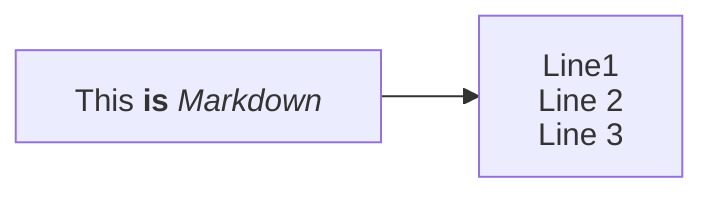

# 最近在做什么

<!-- 这是一个可以随时更新的页面。不必记录每天的事情，只保留当前还在推进的方向。 -->

## 正在学习

<!-- 例如：某个技术方向、一本书或一门课程。 -->

## 正在做

<!-- 例如：个人项目、博客整理或工作中的一个主题。 -->

## 近期计划

<!-- 写下未来几周或几个月想完成的事。完成后删除或移到对应文章。 -->

## mermaid 测试

