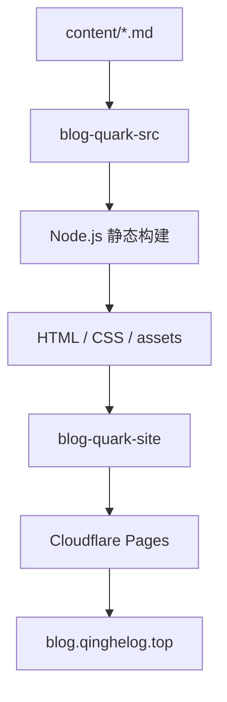

# 这个博客是怎么搭起来的

这个博客一开始并不是为了做一个功能完整的内容平台。我只是想有一个自己能长期维护的地方：原稿是普通 Markdown，目录和文件都在自己手里，换一台电脑或换一种发布方式也不至于把内容困在某个系统里。

它因此更接近一个个人知识站，而不是按日期滚动更新的传统博客。这里记录技术、学习、项目和一些持续思考；写作仍然发生在熟悉的文件里，网站只负责把这些文件变成适合阅读的页面。

## 为什么选择一套很轻的方案

我希望维护博客这件事本身不要抢走太多注意力。直接使用成熟博客系统当然可以获得主题、标签、评论和后台管理，但这些并不是我当前真正需要的功能。对只有少量个人内容的网站来说，数据库、服务端程序和一整套管理界面反而意味着更多升级、备份和故障点。

Markdown 适合做长期原稿：它是纯文本，能被 Git 清楚地记录修改，也不依赖某一个编辑器。即使以后不再使用现在的构建脚本，原始内容仍然能直接阅读、搜索和迁移。

所以这个站保留了几个简单选择：Markdown 作为内容源，自定义 Node.js 脚本负责构建，输出纯 HTML、CSS 和少量必要的 JavaScript，不使用数据库，也不运行长期在线的应用服务。

## 当前架构

从写下一篇 Markdown 到在线页面，实际链路如下：



源码仓库 `goodqinghe/blog-quark-src` 保存 Markdown、站点配置、构建脚本和发布工作流。构建产生的 `dist/` 不需要人工编辑，而是由 GitHub Actions 同步到成品仓库 `goodqinghe/blog-quark-site`。Cloudflare Pages 监听成品仓库的 `main` 分支，再把这些静态文件发布到当前域名。

## 一次构建具体做了什么

### 读取 Markdown 和 Frontmatter

构建脚本递归读取 `content/`。每篇文章至少可以在 Frontmatter 中写一个 `title`；需要进入“最近更新”时，再提供一个 `updated` 日期。站点没有为了可能出现的需求预先设计十几个字段。

Markdown 文件会在相同路径生成对应的 HTML。例如：

```text
content/blog/how-this-blog-is-built.md
    ↓
dist/blog/how-this-blog-is-built.html
```

如果文章旁边还有图片、PDF 或代码文件，构建脚本会按原目录复制。Markdown 原稿也会保留在输出中，因此成品仓库既能提供网页，也保留了可以直接查看的文本版本。

### Markdown 渲染和链接转换

正文使用 `markdown-it` 转成 HTML。文章之间仍然可以在原稿里链接 `.md` 文件；渲染时，这些链接会自动转换为对应的 `.html`，所以写作时不需要用网站输出路径思考。

这种处理很小，却很重要：Markdown 文件在本地是成立的，生成到网站以后也仍然能够互相跳转。

### Shiki 和 Mermaid

代码块由 Shiki 在构建时完成语法高亮，最终页面不需要再下载一个高亮服务。Mermaid 稍有不同：构建时会识别 Mermaid 围栏，并把所需运行文件复制到站点自己的 `_site/mermaid/` 目录；浏览器打开包含图表的文章时，再从本站静态资源渲染图形。

这些资源都随网站一起发布，不依赖外部 CDN。上面的架构图也正好是这条 Mermaid 链路的实际例子。

### 静态资源与 site-map.json

除了文章页面，构建还会生成统一样式和 `site-map.json`。后者只记录当前真实存在的文章标题、源路径和页面地址，是一份很小的站点清单；它不是搜索服务，也没有被扩展成复杂内容数据库。

### GitHub Actions 和发布

源码仓库的 `main` 有新提交后，GitHub Actions 会使用 Node.js 20 执行：

```bash
npm ci
npm run build
```

构建成功后，工作流把 `dist/` 同步到成品仓库。Cloudflare Pages 只需要面对已经生成好的静态文件。日常发布因此仍然是普通的 Git 流程：修改 Markdown，检查构建，推送源码。

## 为什么拆成源码仓库和成品仓库

两个仓库的职责不同。源码仓库回答“这个博客怎样生成”，里面是原稿、配置和代码；成品仓库回答“需要部署哪些文件”，里面是浏览器可以直接访问的结果。

这样拆分并不是为了显得架构复杂，而是为了让 Cloudflare Pages 的输入足够干净，也避免在源码仓库中长期手工维护大量生成文件。构建结果同样拥有 Git 历史，出现发布问题时可以对照某次输出；真正需要编辑的内容则始终只在源码仓库中维护。

代价是发布链多了一个仓库和一次同步。如果这个站只有几个手写 HTML 页面，这可能没有必要；但在当前“Markdown 原稿 + 自动构建”的前提下，这个边界仍然清楚，也没有带来太重的维护负担。

## 文件目录曾经也是阅读目录

这个博客最初直接把文件树画成首页和侧栏导航。它有一个很直观的优点：不需要额外配置，文件放在哪里，读者就在哪里看到它；作者理解的知识结构和站点结构完全一致。

内容很少时，这种方式简单而有效。问题也正是在内容开始增长之前暴露出来的：文件夹名通常为源码管理服务，不一定适合作为读者看到的分类名；物理路径可能需要多层，但阅读入口未必需要把每一层都展开；首页如果只有整棵树，也无法说明“这是谁的网站、该从哪里开始”。

因此这次调整没有放弃文件系统，而是在它上面加了一层很薄的信息架构配置：顶层分类可以有中文显示名、简短说明和排序；文章页只展开当前分类；首页单独呈现“开始这里”“内容”和“最近更新”。Markdown 仍然放在原来的目录逻辑中，但读者不再被迫按照完整文件路径阅读。

## 这套设计的取舍

它目前最重要的优点是简单、可保存和可迁移：

- 原稿是普通文件，Git 保存每次修改；
- 没有数据库，不需要运行和维护服务端；
- 构建与发布自动完成，日常写作不必手工复制网页；
- 输出是标准静态文件，可以迁移到其他托管平台；
- 构建脚本规模有限，出现问题时仍然能够从头读懂。

限制也同样明显。它没有后台、评论、全文搜索、标签系统或动态 API；内容模型只覆盖当前真正使用的页面；自定义构建脚本需要自己维护。这些不是被遗漏的“高级功能”，而是当前有意保留的边界。

如果以后某个功能只有“也许会有用”这一个理由，我希望先不做。这个博客真正需要长期维护的是内容，以及内容之间越来越清楚的关系，而不是功能数量。

## 结尾

这个站没有复杂到值得被称为一套框架。它只是把几件朴素的工具接在了一起：Markdown 负责写作，Node.js 负责生成，GitHub Actions 负责搬运，Cloudflare Pages 负责发布。

对我来说，合适的博客不是功能最多的博客，而是过一段时间以后，我仍然愿意打开原稿、继续写下去，也仍然能解释它为什么这样工作。
